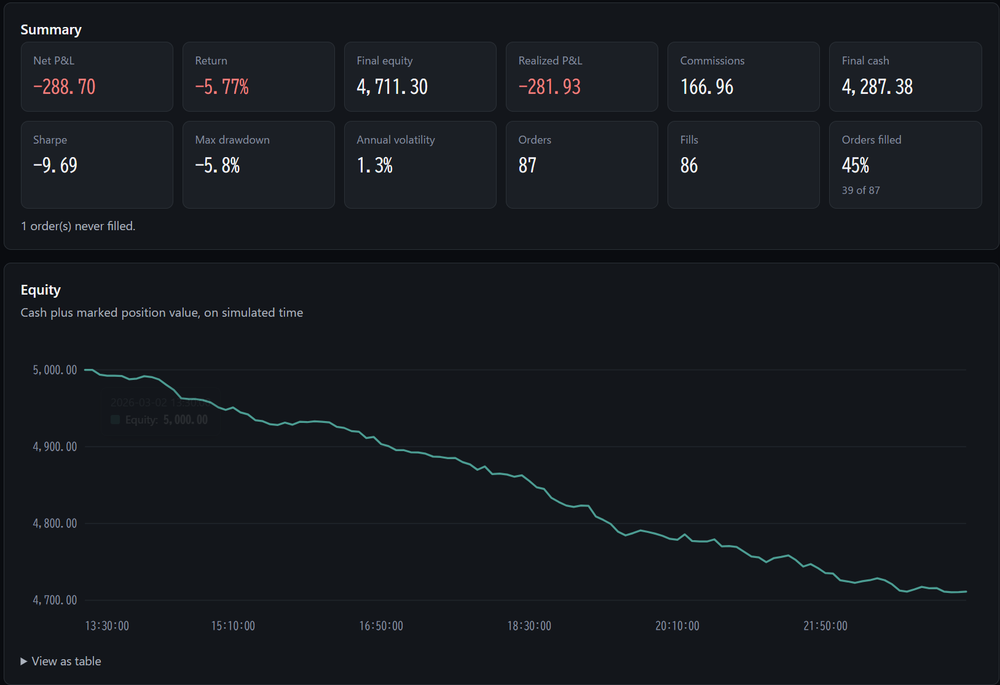
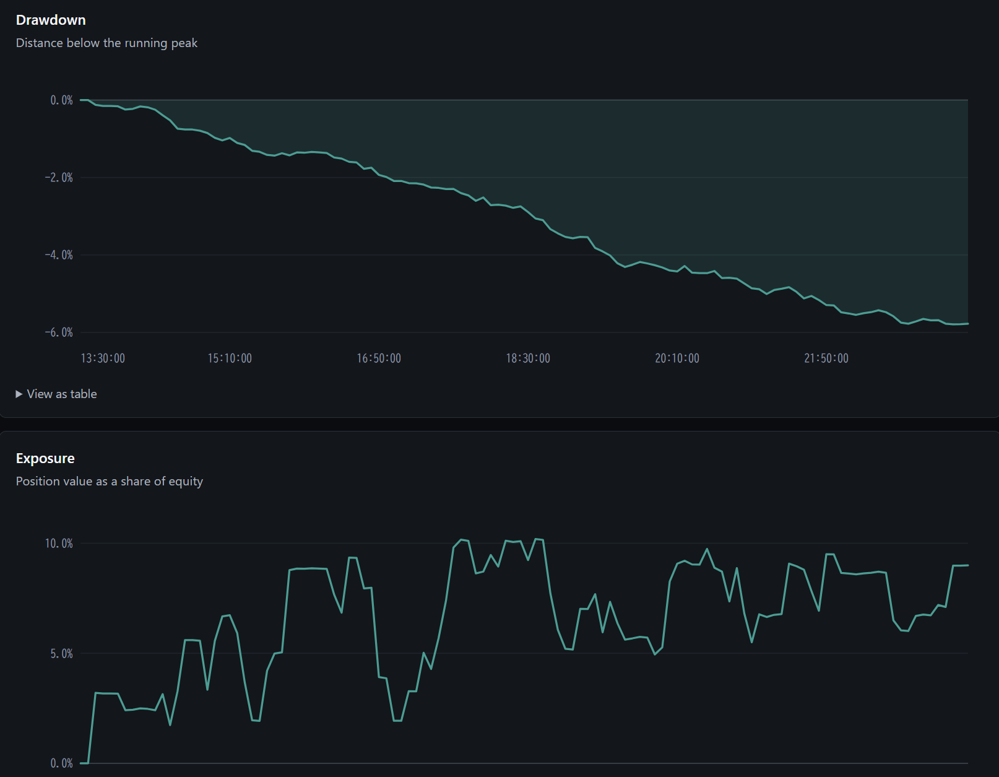
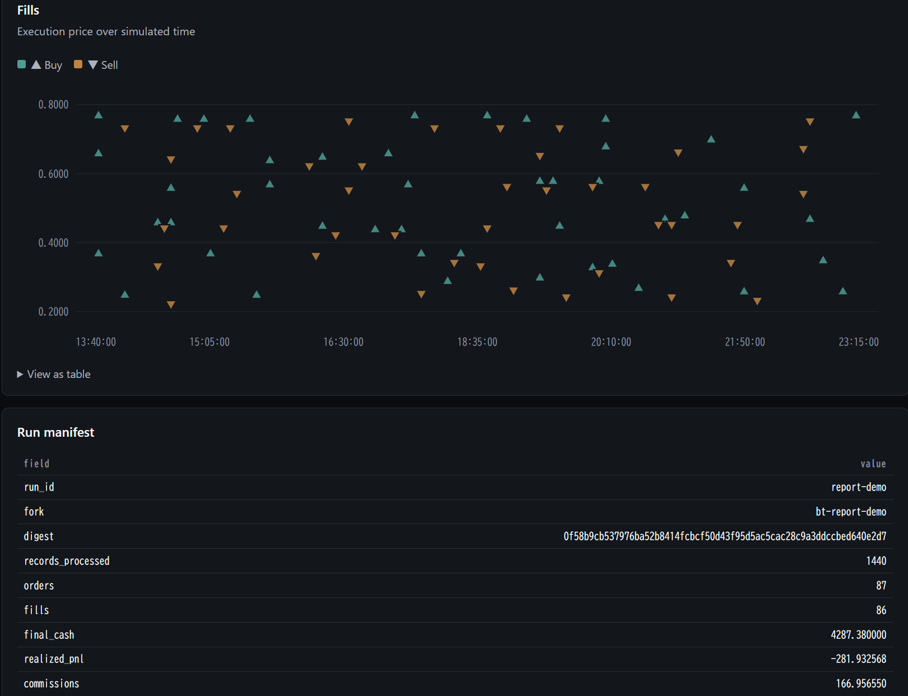
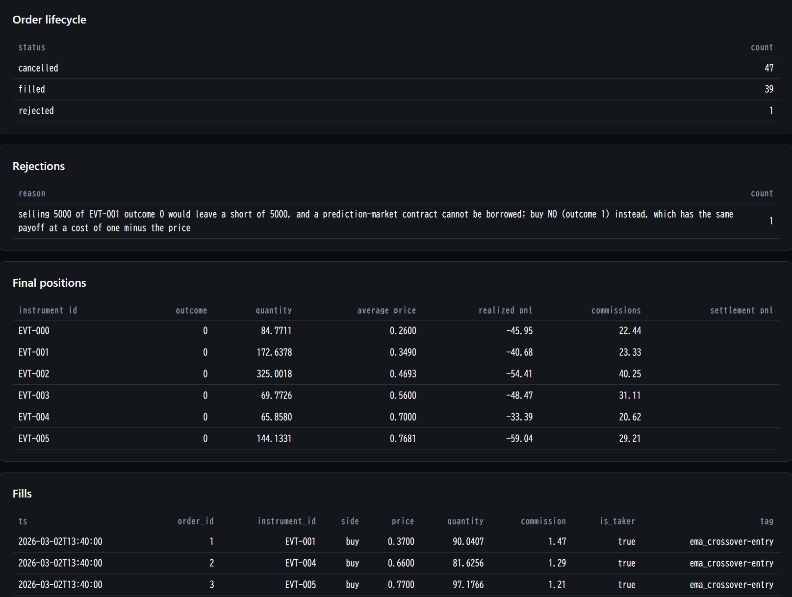

# h5i-db

<a href="https://github.com/h5i-dev/h5i-db/actions/workflows/ci.yml"></a>
<a href="https://pepy.tech/projects/h5i-db"></a>
<a href="https://github.com/h5i-dev/h5i-db/blob/main/LICENSE"></a>

[English](README.md) · [Español](README.es.md) · [Français](README.fr.md) · [简体中文](README.zh-CN.md) · **日本語**

**クオンツ研究のための、速くてエージェント前提の時系列データベースとバックテスト
エンジン。組み込み型、Rust製。**

- **時系列の形に速い:** 2000万行のOHLCV+VWAP集計で、DuckDBとPolarsより4.5倍以上速い。
- **時系列SQLがそのまま使える:** ASOF join、タイムゾーンを解釈する `time_bucket`、
  gapfill/resample、移動窓、`vwap`、`ewma`。
- **時点を固定した読み取り:** 判断時刻を固定すれば、pandasまで届くデータフレームに
  それ以降の行は入りようがない。先読みバイアスは構造的に起こらない。
- **速いイベント駆動バックテスタ:** リプレイカーネルは毎秒305万イベントを処理し、
  同一ワークロードでNautilusTraderの11.7倍、LEANの31倍。
- **取引所をそのまま扱える:** [Kalshi](#データソース)、[Polymarket](#データソース)、[Hyperliquid](#データソース)、[Binance](#データソース) ほか。
- **本格的な統計分析:** `alphalens`・`empyrical` と一致するファクターおよび
  パフォーマンス指標に加えて、deflated Sharpeと過剰適合確率の検出。
- **データベースをミリ秒でforkできる:** forkはデータをコピーせず共有する。
  分岐して、変えて、評価して、捨てる。この試行錯誤をエージェントがほぼ無料で
  何度でも回せる。
- **書き込みはすべて原子的でバージョン付きのコミット:** 過去のどのバージョンも
  O(1)で読める。取り込みをしくじっても、それが人の操作でもエージェントの操作でも、
  `restore` 一回で元に戻る。
- **エージェントの書き込みを縛る安全策:** 変更を事前に確認できるプレビュー、
  ポリシーによるゲート、破壊的な操作を止めるフェイルクローズの制約、そして
  何がなぜ変わったかを残す監査証跡。

📖 **[ドキュメント](https://db.h5i.dev/manual/)** · [バックテスト](https://db.h5i.dev/manual/backtest/) · [クオンツ](https://db.h5i.dev/manual/quant/) · [Python API](https://db.h5i.dev/api/) ·
[クックブック](https://github.com/h5i-dev/h5i-db-cookbook) · [エージェント向けskill](skills/h5i-db/SKILL.md)

---

## クイックスタート

**CLI**

```bash
cargo install h5i-db-cli
```

```bash
h5i-db init market.db
h5i-db create-table market.db trades --like ticks.parquet --time-column ts
h5i-db ingest market.db trades ticks.parquet --idempotency-key load-1
h5i-db context market.db                                           # 一回の呼び出しで全体を把握する
h5i-db query market.db "SELECT symbol, vwap(price,size) FROM trades GROUP BY symbol"
h5i-db query market.db "SELECT count(*) FROM trades" \
  --decision-time 2026-07-01T00:00:00Z                             # 未来は読めない
h5i-db ui market.db                                                # レビューと実験の画面
```

**ターミナルのノートブック**

```bash
h5i-db nb new research.ipynb --kernel python3 --db market.db
h5i-db nb view research.ipynb        # ⏎ 編集 · e 実行 · a セル追加 · ? キー一覧 · q 終了
```

`%%sql` で始まるセルは、Pythonを介さずにデータベースへ直接問い合わせる。

```sql
%%sql
SELECT symbol, count(*) AS trades FROM trades GROUP BY symbol
```

```bash
h5i-db nb watch research.ipynb --split right   # エージェントの作業を隣で眺める
h5i-db nb export research.ipynb --to html
```

保存されるのは普通の `.ipynb` なので、同じファイルをJupyterLabでも開ける。
Pythonカーネルには `pip install ipykernel` が必要だが、`%%sql` のセルには
何もいらない。エージェントは同じセッションを `h5i-db nb exec` から非対話で
動かせる。

**Pythonライブラリ（DataFrameとSQL）**

```bash
pip install h5i-db
```

```python
import pyarrow as pa
import h5i_db

db = h5i_db.Database("market.db", create=True)

db.create_table(
    "trades",
    pa.schema([("ts", pa.timestamp("us")), ("symbol", pa.string()), ("price", pa.float64())]),
    time_column="ts",
)
db.append("trades", pa.table({
    "ts": pa.array([1_700_000_000_000_000, 1_700_000_060_000_000], pa.timestamp("us")),
    "symbol": ["AAPL", "MSFT"], "price": [187.4, 411.2],
}))

df = db.sql("SELECT symbol, avg(price) AS px FROM trades GROUP BY symbol").to_pandas()
# df = db.table("trades").group_by("symbol").agg(px=col("price").mean()).to_pandas()
old = db.read("trades", version=1)                # タイムトラベル: 過去のどのバージョンでも読める

plan = db.plan_delete_range("trades", 1_700_0_000_000)
print(plan.summary)                               # 変更が確定する前に中身を確認する
plan.apply()
```

**Pythonライブラリ（バックテスト）**：同じインストールのまま、サーバーはいらない

```python
from h5i_db import backtest

config = backtest.BacktestConfig(
    run_id="momentum-001",
    data=backtest.DataConfig(signals="signals", snapshot="2024-q1"),   # 固定するピン
    portfolio=backtest.PortfolioConfig(starting_cash=100_000.0),
    execution=backtest.ExecutionConfig(fee_kind="kalshi", fee_rate=0.07),
    risk=backtest.RiskConfig(max_order_quantity=500.0),
)

backtest.inspect(db, config).raise_for_errors()  # データが支えられない主張は断る
result = backtest.execute(db, config)            # fork "bt-momentum-001" の中で走る

result.summary()                  # 約定件数、最終残高、どこまで実際に再現できたか
result.explain()                  # 注文が拒否された理由、約定しなかった理由
result.fills                      # Arrowで受け取る。SELECT * FROM bt_fills でもよい
result.tearsheet("run.html")
result.verify()                   # 保存された設定で再実行して突き合わせる
```

パラメータグリッドは1試行ごとに1つのforkになり、エクスポートを挟まずに順位が出る。
学習期間とホールドアウト期間を明示すれば各試行が両方の期間を走るので、
リーダーボードをアウトオブサンプルで読める:

```python
board = backtest.study(
    db, study_id="fees", base=config,
    parameters={"execution.fee_rate": [0.0, 0.02, 0.07]},
    validation=backtest.ValidationWindows(
        train=("2024-01-01", "2024-04-01"), holdout=("2024-04-01", "2024-07-01")
    ),
).leaderboard("holdout_final_cash")
```

**エージェント向けskill**（Claude Code、Codex、Cursorなど）

```bash
npx skills add h5i-dev/h5i-db        # skills/h5i-db/ からh5i-dbのskillを入れる
```

**動かして見る**

```bash
python examples/backtest_report_demo.py
```

<p align="center">
  
  
  <br />
  
  
</p>

---

## なぜ速いのか

- **マニフェストによる枝刈り:** バージョンごとのマニフェストが、セグメント単位の
  時間範囲と列ごとの最小値・最大値を持っている。範囲の狭いクエリは、ファイルを
  一つも開かないうちにセグメントごと丸ごと捨てる。
- **ソート順を宣言する:** セグメントは時間順に並べて保存し、クエリ層がそのことを
  DataFusionに伝える。おかげでOHLCV集計は2000万行を先にソートせずストリーム処理で
  済み（比較対象はどれもこのソート代を払っている）、ASOF joinもソートがいらない。
- **セグメントは不変:** フッタのメタデータを無条件にキャッシュできる。セグメントが
  決して書き換わらないから安全で、これでウォームスキャンが約40%縮む。
- **バージョンを意識した集計状態:** OHLCV/VWAPの集計は、不変セグメントごとに
  マージ可能な途中状態を保存する。次に同じ問い合わせが来たら再計算せず、状態を
  ミリ秒でマージし、新しく追加されたセグメントだけを読む。
- **遅延リプレイ:** バックテストのカーネルは区間を一度に展開せず、レコードを
  一件ずつ引く。だから1日を再現しようが1億イベントを再現しようが、メモリの使用量は
  変わらない。
- **注文照合はインデックス経由:** 板に残る注文は会場と価格でインデックスしてある。
  新しい約定が起こすのは実際に交差する注文だけで、開いている注文を全部見直すことはない。

---

## なぜエージェント向きなのか

- **入力を再現できる。** 読み取りは必ず特定のバージョンに解決される。だから
「この実行はどのデータを見たのか」に答えがあるし、そのバージョンに対して
実行し直すのはO(1)の操作で、発掘作業にはならない。
- **結果でコンテキストウィンドウを潰さない。** `H5I_DB_PROFILE=agent` は
クエリごとに上限を設け、あふれた分はParquetに書き出す。そのうえで本当の行数と、
書き出した行の置き場所を報告する。
- **手を打てるエラーが返る。** stderrに出るエラー封筒には、そのまま実行できる
コマンド（`next_actions`）、打ち間違いに対する `did_you_mean`、再試行してよいかを
示す `retryable` が入っている。
- **コピーせずに分岐する。** `fork` は全テーブルの固定されたビューの上に、
書き込める作業領域を開く。データは一切複製しないので、修正一つでも実験一つでも
コストは小さなファイル一個ぶんで、捨てるのは取っておくのと同じくらい安い。
- **権限のコントロール。** 変更は `plan`/`apply` でプレビューでき、ポリシーでその
手順を必須にもできる。`--idempotency-key` を付ければ、取り込みを再試行しても再生に
なる。任意で有効にする `data-policy` は、壊れた行をフェイルクローズで弾く。
- **バックテストの実行はブランチ。** 実行はそれぞれ自分のforkの中で走り、注文・約定・
ポジション・エクイティカーブを普通のテーブルとしてそこに書く。
だから2つの実行は `fork_diff` で約定単位に差分が取れ、スイープ全体は1回のfork横断
クエリで集計でき、残す価値のあるものだけ `promote` して、あとは捨てられる。
- **レビュー画面がやるのは順位付けではなく注意の割り振り。** `h5i-db ui` は、次に人が
見るべき順に試行を並べる。判断が必要、失敗または警告あり、完了して未読、実行中、既読。
一覧を眺めただけでは既読にならない。詳細を開いたときだけ既読が付く。

---

## データソース

ローダーは手元にあるファイルやレスポンスを読む。取得はしないので、認証情報・
リトライ・レート制限はスクリプト側に残る。

| ソース | 板 | 約定 | バー | その他 |
|---|---|---|---|---|
| Kalshi | ✓ | ✓ | ✓ | 決済 |
| Polymarket | ✓ | ✓ | 生成 | 決済、コンプリートセットの発行と償還 |
| Hyperliquid | ✓ | ✓ | ✓ | 資金調達率、マーク・オラクル価格、レバレッジ上限 |
| Limitless | ✓ | ✓ | 生成 | |
| Opinion | ✓ | ✓ | 生成 | |
| Manifold | 該当なし | ✓ | 生成 | 決済 |
| Binance | | ✓ | ✓ | 現物・先物の一括ダンプ |
| OHLCVのエクスポート全般 | | | ✓ | ブローカーのCSV、`yfinance`、Stooq |
| 約定ダンプ全般 | | ✓ | 生成 | |
| 公表系列 | | | | 金利や指数などの参照価格 |
| コーポレートアクション | | | | 分割、配当、上場廃止 |

「生成」は、そのソース自身の約定からバーを集計することを指す。取得したバーでは
ないので、約定のない区間はバーが立たず、欠損がそのまま見える。「該当なし」は
概念自体がないという意味で、Manifoldは自動マーケットメイカーだから約定はあって
も板がない。詳しくは[取引所ガイド](crates/h5i-db-venues/README.md)にある。

---

## こういう用途には*向かない*

- **分散した数テラバイト級のウェアハウス:** 単一ノードの組み込み型として設計して
  いる。ClickHouseやSnowflake、あるいはレイクハウスを使うべき場面。
- **OLTPや高い同時実行のサービング:** 書き手は同時に一つだけで、行レベルのMVCCも
  対話的なトランザクションもない。Postgresの出番。
- **マイクロ秒未満のtick収集:** 想定している書き込みの粒度は分足、日次、ベンダー
  ファイルであって、収集層そのものではない。そこはkdb+の領域。
- **時間列を持たないデータ:** 設計全体が時間インデックスを前提にしている。それが
  ないと枝刈りもASOF joinも時点読み取りも失われる。
- **実弾のトレード:** バックテスタは本物の注文を一度も出さない。ブローカー接続も
  ポートフォリオ最適化も作図APIもない。担当範囲はシミュレーションと評価まで。

---

## ベンチマーク

計測方法と結果は [benchmarks](benchmarks) に全部書いてある。

**データベース**

| | DuckDB | Polars | pandas | PyArrow | ArcticDB | **h5i-db** |
|---|---|---|---|---|---|---|
| 利用者から見えるバージョン管理・タイムトラベル | ✗¹ | ✗ | ✗ | ✗ | ✓ | ✓（バージョン読み取りはO(1)） |
| join・窓関数・CTEを備えたSQL | ✓ | 一部 | ✗ | ✗ | ✗ | ✓（DataFusion） |
| ASOF join | ✓ | ✓ | ✓ | ✗² | ✗ | ✓⁴（ソート済みストレージ上でソート不要） |
| 変更のプレビュー（plan/apply） | ✗ | ✗ | ✗ | ✗ | ✗ | ✓、ポリシーで強制もできる |
| 書き込みの同時実行 | MVCC | 該当なし | 該当なし | 該当なし | 安全でない³ | CAS＋明示的な衝突 |
| 2000万行・狭い時間範囲のスキャン | 45.5 ms | 28.1 ms | 23.9 ms | 22.8 ms | **4.2 ms**⁵ | 10.0 ms |
| 2000万行・1分足のOHLCV+VWAP | 7237 ms | 7309 ms | 5115 ms | 7121 ms | 3504 ms | **1558 ms** |
| 2000万行・銘柄別のASOF join | 11566 ms | **1485 ms** | 6624 ms | ✗² | 7008 ms | 1548 ms |


¹ `AT (VERSION …)` という構文はあるが、ネイティブのストレージが受け付けない。
² 実験的な `join_asof` はあるものの約1000倍遅く、この規模では使いものにならない。
³ 銘柄ごとに書き手は一つ、という前提が文書化されている。
⁴ ネイティブの `ASOF JOIN … MATCH_CONDITION` 構文と、`asof_join(...)` テーブル関数。
  SQLからもPythonからも呼べる。
⁵ 狭い範囲のピンポイントな読み取りは、ArcticDBが自前のLMDBストア上のネイティブな
  時間インデックスで勝つ。h5i-dbのマニフェスト枝刈りはそれに次ぐ2位で、汎用エンジンは
  すべて上回っている。

**バックテスト**

| エンジン | 計測した境界 | 中央値 | スループット |
|---|---|---:|---:|
| **h5i-db** | デコード済みレコードがリプレイカーネルを通る区間 | **65.7 ms** | **305万 events/s** |
| h5i-db `wide` | 同じカーネル、128ビット固定小数点 | 94 ms⁷ | 213万 events/s⁷ |
| **h5i-db** | 同じカーネル、戦略はイベントごとの Python コールバック | 278 ms⁶ | 71.9万 events/s⁶ |
| h5i-db `wide` | 同上、128ビット固定小数点 | 306 ms⁶ ⁷ | 65.3万 events/s⁶ ⁷ |
| **h5i-db** | 永続化を含む実行全体: スキャン、デコード、fork、リプレイ、書き込み | 280 ms | 71.3万 events/s |
| h5i-db `wide` | 同上、128ビット固定小数点 | 280 ms | 71.3万 events/s |
| NautilusTrader 1.230.0 | メモリ上のオブジェクトが `BacktestEngine.run()` を通る区間 | 767 ms | 26.1万 events/s |
| LEAN `11ba019f6` | 最初の `Slice` コールバックから `OnEndOfAlgorithm` まで、ディスク供給 | 2,033 ms | 9.84万 events/s |

1回のウォームアップの後、プロセスを新しくして3回計測した中央値。どのアダプタも
20万件のイベントを全部見て200件の注文を全部出したことを検証している。計測した境界は
列に書いたとおり異なる。照合するのはイベント数と注文数で、PnLの一致ではない。
⁶ 他の行はリプレイ中に Python を呼ばない。この行はイベントごとに Python へ渡る、
Nautilus と同じ形。コールバック同士なら差は13倍ではなく3.1倍。導出値
（ネイティブカーネル＋実測した境界費用）で、直接計測ではない。
⁷ `--features wide`。既定では無効。詳しくは
[精度と範囲](https://db.h5i.dev/manual/backtest/)。直接計測ではなく導出値。手法は
[RESULTS.md](benchmarks/backtest_compare/RESULTS.md)。

---

## 開発

```bash
# パッケージごとに、スレッド数を抑えて実行します。DataFusion のセッションと
# tokio のランタイムを立ち上げるスイートが複数あるため、ワークスペース全体を
# 一度に走らせるとメモリの小さいマシンでは足りなくなることがあります。
for pkg in h5i-db-core h5i-db-query h5i-db-backtest h5i-db-cli h5i-db-ui; do
  cargo test -p $pkg -- --test-threads=2
done
cargo run -p h5i-db-bench --profile bench-fast -- --trades 1000000
cargo run -p h5i-db-bench --profile bench-fast --bin h5i-db-fork-bench
python3 benchmarks/backtest_compare/run.py \
  --output benchmarks/backtest_compare/results.json   # NautilusTrader・LEANとの比較
```

`crates/` 以下のワークスペースcrate: `core`（バージョン管理付きストレージの中核）、
`query`（DataFusion層）、`backtest`（リプレイカーネル、会場モデル、決済）、
`venues`（Kalshi・Polymarket・Hyperliquidのローダー）、`cli`（エージェントが触る
バイナリ）、`ui`（レビュー画面）、`observability`、`python`
（`pip install h5i-db`）、`bench`。

---

## ライセンス

Apache-2.0。[LICENSE](./LICENSE) を参照。
