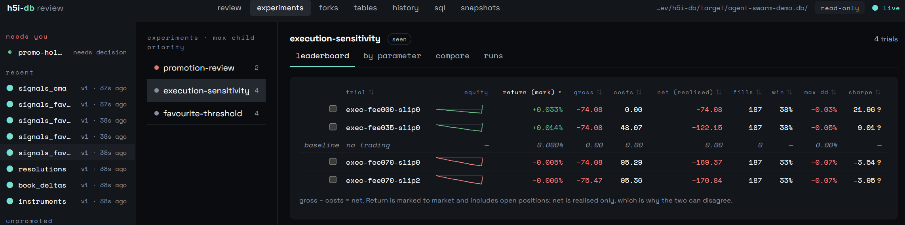

# h5i-db

**English** · [Español](README.es.md) · [Français](README.fr.md) · [简体中文](README.zh-CN.md) · [日本語](README.ja.md)

**A fast, agent-native time-series *d*atabase and *b*acktesting engine for quant research.
Embedded, written in Rust.**

- **Fast for time-series shape:** over 4.5× faster than DuckDB and Polars
  on OHLCV+VWAP rollups over 20M rows.
- **Native time-series SQL:** ASOF join, timezone-aware `time_bucket`,
  gapfill/resample, rolling windows, `vwap`, `ewma`.
- **Point-in-time reads:** pin a decision time and the frame that reaches
  pandas cannot contain rows from after it. No lookahead bias, by construction.
- **Efficient event-driven backtester:** 3.05M events/s through
  the replay kernel, 11.7× NautilusTrader and 31× LEAN on a shared
  top-of-book workload.
- **Native venue support:** [Kalshi](https://github.com/h5i-dev/h5i-db/tree/improve-kalshi-support#data-sources), [Polymarket](https://github.com/h5i-dev/h5i-db/tree/improve-kalshi-support#data-sources), [Hyperliquid](https://github.com/h5i-dev/h5i-db/tree/improve-kalshi-support#data-sources), [Binance](https://github.com/h5i-dev/h5i-db/tree/improve-kalshi-support#data-sources) and more.
- **Professional statistical analysis:** factor and performance metrics at
  `alphalens` and `empyrical` parity, plus deflated Sharpe and
  overfitting-probability detection.
- **Fork a database in milliseconds:** forks share data instead of copying it. 
  Agents can run wide trial-and-error loops (fork, mutate, evaluate, discard) 
  at almost zero cost.
- **Every write is an atomic, versioned commit:** any past version reads in
  O(1), so a bad ingest (human or agent) is one `restore` away from undone.
- **Safety policies for agent writes:** previewable mutations, policy gates,
  fail-closed constraints that block destructive operations, and an audit
  trail of what changed and why.

📖 **[Documentation](https://db.h5i.dev/manual/)** · [Backtesting](https://db.h5i.dev/manual/backtest/) · [Quant](https://db.h5i.dev/manual/quant/) · [Python API](https://db.h5i.dev/api/) ·
[Cookbook](https://github.com/h5i-dev/h5i-db-cookbook) · [Agent skill](skills/h5i-db/SKILL.md)

---

## Quickstart

**CLI**

```bash
cargo install h5i-db-cli
```

```bash
h5i-db init market.db
h5i-db create-table market.db trades --like ticks.parquet --time-column ts
h5i-db ingest market.db trades ticks.parquet --idempotency-key load-1
h5i-db context market.db                                           # orient in one call
h5i-db query market.db "SELECT symbol, vwap(price,size) FROM trades GROUP BY symbol"
h5i-db query market.db "SELECT count(*) FROM trades" \
  --decision-time 2026-07-01T00:00:00Z                             # the future is unreadable
h5i-db ui market.db                                                # review + experiments surface
```

**Python Library for DataFrames and SQL**

```bash
pip install h5i-db
```

```python
import pyarrow as pa
import h5i_db

db = h5i_db.Database("market.db", create=True)

db.create_table(
    "trades",
    pa.schema([("ts", pa.timestamp("us")), ("symbol", pa.string()), ("price", pa.float64())]),
    time_column="ts",
)
db.append("trades", pa.table({
    "ts": pa.array([1_700_000_000_000_000, 1_700_000_060_000_000], pa.timestamp("us")),
    "symbol": ["AAPL", "MSFT"], "price": [187.4, 411.2],
}))

df = db.sql("SELECT symbol, avg(price) AS px FROM trades GROUP BY symbol").to_pandas()
# df = db.table("trades").group_by("symbol").agg(px=col("price").mean()).to_pandas()
old = db.read("trades", version=1)                # time travel: read any past version

plan = db.plan_delete_range("trades", 1_700_0_000_000)
print(plan.summary)                               # preview the mutation before it lands
plan.apply()
```

**Python Library for Backtesting** (same install, no server)

```python
from h5i_db import backtest

config = backtest.BacktestConfig(
    run_id="momentum-001",
    data=backtest.DataConfig(signals="signals", snapshot="2024-q1"),   # the pin
    portfolio=backtest.PortfolioConfig(starting_cash=100_000.0),
    execution=backtest.ExecutionConfig(fee_kind="kalshi", fee_rate=0.07),
    risk=backtest.RiskConfig(max_order_quantity=500.0),
)

backtest.inspect(db, config).raise_for_errors()  # refuse claims the data can't support
result = backtest.execute(db, config)            # replays inside fork "bt-momentum-001"

result.summary()                  # fills, final cash, how far it actually simulated
result.explain()                  # why orders were rejected or never filled
result.fills                      # Arrow, or just SQL it: SELECT * FROM bt_fills
result.tearsheet("run.html")
result.verify()                   # re-execute the stored config and compare
```

A parameter grid becomes one fork per trial, and the winner is ranked without
an export step. Give it explicit train and holdout windows and every trial runs
both phases, so the leaderboard can be read out of sample:

```python
board = backtest.study(
    db, study_id="fees", base=config,
    parameters={"execution.fee_rate": [0.0, 0.02, 0.07]},
    validation=backtest.ValidationWindows(
        train=("2024-01-01", "2024-04-01"), holdout=("2024-04-01", "2024-07-01")
    ),
).leaderboard("holdout_final_cash")
```

**Agent skill** (Claude Code, Codex, Cursor, …)

```bash
npx skills add h5i-dev/h5i-db        # installs the h5i-db skill from skills/h5i-db/
```

**See it work**

```bash
python examples/agent_swarm_demo.py   # three agents, eleven trials, then the UI
```

Runs a fleet against one pinned dataset: a threshold sweep, an execution-cost
ladder, and a validation flagged for human sign-off.

<p align="center">
  
</p>

---

## Data sources

Loaders read files and payloads you already have. Nothing here fetches, so
credentials, retries and rate limits stay in your script.

| Source | Order book | Trades | Bars | Also |
|---|---|---|---|---|
| Kalshi | ✓ | ✓ | ✓ | settlement |
| Polymarket | ✓ | ✓ | derived | settlement, complete-set mint and redeem |
| Hyperliquid | ✓ | ✓ | ✓ | funding, mark and oracle prices, leverage caps |
| Limitless | ✓ | ✓ | derived | |
| Opinion | ✓ | ✓ | derived | |
| Manifold | n/a | ✓ | derived | settlement |
| Binance | | ✓ | ✓ | spot and futures bulk dumps |
| Any OHLCV export | | | ✓ | a broker CSV, `yfinance`, Stooq |
| Any trade dump | | ✓ | derived | |
| Published series | | | | reference prices, for a rate or an index |
| Corporate actions | | | | splits, dividends, delistings |

`derived` means bars are aggregated from that source's own prints rather than
fetched, so gaps stay visible as missing bars. `n/a` means the venue has no
such concept: Manifold is an automated market maker, so it has prints but no
book. See [venue guide](crates/h5i-db-venues/README.md) for the detail.

---

## Why it's fast

- **Manifest pruning:** every version's manifest carries per-segment time
  ranges and column min/max. Narrow queries prune whole segments before a
  single file is opened.
- **Declared sort order:** segments are stored time-sorted and the query
  layer tells DataFusion so. OHLCV rollups stream instead of sorting 20M rows
  first (every baseline pays that sort), and the ASOF join is sort-free.
- **Immutable segments:** footer metadata is cached unconditionally (sound
  because segments never change), cutting ~40% off warm scans.
- **Version-aware aggregate states:** OHLCV/VWAP rollups persist mergeable
  states per immutable segment; re-queries merge states in milliseconds
  instead of recomputing, scanning only newly appended segments.
- **Lazy replay:** the backtest kernel pulls records one at a time instead of
  materializing a window, so memory stays flat whether a run replays a day or a
  hundred million events.
- **Indexed order matching:** resting orders are keyed by market and price, so a
  new print wakes only the orders it actually crosses instead of rescanning
  every open one.

---

## Why for agents

- **Reproducible inputs:** every read resolves to a version, so "which data did
this run see" has an answer, and re-running against that version is O(1) rather
than an archaeology project.
- **Don't let a result destroy the context window.** `H5I_DB_PROFILE=agent` caps
every query and spills the rest to Parquet, reporting the true row count and
where the withheld rows live.
- **Errors that can be acted on:** the stderr envelope carries `next_actions`
(runnable commands), `did_you_mean` for typos, and a `retryable` flag.
- **Branch without copying.** `fork` opens a writable workspace over a pinned
view of every table and duplicates no data, so an edit or an experiment costs
one small file and is as cheap to discard as to keep.
- **Privilege control.** Mutations preview through `plan`/`apply` and policy can
require that gate; `--idempotency-key` makes a retried ingest replay; an opt-in 
`data-policy` rejects malformed rows fail-closed.
- **A backtest run is a branch.** Each run executes inside its own
fork and writes its orders, fills, positions and equity curve there as ordinary
tables. So two runs diff at fill level with `fork_diff`, a whole sweep aggregates
in one cross-fork query, the one worth keeping is `promote`d and the rest are
dropped.
- **The review surface routes attention rather than ranking.** `h5i-db ui` orders
trials by what needs a human next: decision required, then failed or warned, then
finished and unseen, then running, then seen. Scanning a list does not mark work
reviewed; a trial counts as seen only when its detail is opened.

---

## When *not* to use h5i-db

- **Distributed, multi-terabyte warehouses:** single-node and embedded by
  design. Reach for ClickHouse, Snowflake or a lakehouse.
- **OLTP or high-concurrency serving:** one writer at a time, no row-level
  MVCC, no interactive transactions. Use Postgres.
- **Sub-microsecond tick capture:** the write cadence this is built for is
  minute bars, end-of-day, and vendor files, not the capture layer itself.
  That is kdb+ territory.
- **Databases with no time column:** the whole design assumes a time index;
  without one you lose pruning, the ASOF join, and point-in-time reads.
- **Live trading:** the backtester never routes a real order. There are no
  brokerage adapters, no portfolio optimiser and no plotting API; the boundary
  is simulation and evaluation.

---

## Benchmark

Full methodology and results in [benchmarks](benchmarks).

**Database**

| | DuckDB | Polars | pandas | PyArrow | ArcticDB | **h5i-db** |
|---|---|---|---|---|---|---|
| User-facing versioning / time travel | ✗¹ | ✗ | ✗ | ✗ | ✓ | ✓ (O(1) version reads) |
| SQL joins/windows/CTEs | ✓ | partial | ✗ | ✗ | ✗ | ✓ (DataFusion) |
| ASOF join | ✓ | ✓ | ✓ | ✗² | ✗ | ✓⁴ (sort-free on sorted storage) |
| Previewable mutations (plan/apply) | ✗ | ✗ | ✗ | ✗ | ✗ | ✓, policy-enforceable |
| Concurrent writers | MVCC | n/a | n/a | n/a | unsafe³ | CAS + explicit conflict |
| 20M-row narrow time-range scan | 45.5 ms | 28.1 ms | 23.9 ms | 22.8 ms | **4.2 ms**⁵ | 10.0 ms |
| 20M-row 1-min OHLCV+VWAP | 7237 ms | 7309 ms | 5115 ms | 7121 ms | 3504 ms | **1558 ms** |
| 20M-row ASOF join (by symbol) | 11566 ms | **1485 ms** | 6624 ms | ✗² | 7008 ms | 1548 ms |

¹ `AT (VERSION …)` syntax exists but native storage rejects it.
² Experimental `join_asof` exists but is ~1000× slower, impractical at this scale.
³ Documented single-writer-per-symbol assumption.
⁴ Native `ASOF JOIN … MATCH_CONDITION` SQL syntax and an `asof_join(...)`
  table function (SQL and Python).
⁵ ArcticDB's native time index wins narrow point reads from its own LMDB
  store; h5i-db's manifest pruning is second and beats every general engine.

**Backtesting**

| engine | measured boundary | median | throughput |
|---|---|---:|---:|
| **h5i-db** | decoded records through the replay kernel | **65.7 ms** | **3.05 M events/s** |
| h5i-db `wide` | same kernel, 128-bit fixed point | 94 ms⁷ | 2.13 M events/s⁷ |
| **h5i-db** | same kernel, strategy as a Python callback per event | 278 ms⁶ | 719 k events/s⁶ |
| h5i-db `wide` | same, 128-bit fixed point | 306 ms⁶ ⁷ | 653 k events/s⁶ ⁷ |
| **h5i-db** | full persisted run: scan, decode, fork, replay, write | 280 ms | 713 k events/s |
| h5i-db `wide` | same, 128-bit fixed point | 280 ms | 713 k events/s |
| NautilusTrader 1.230.0 | in-memory objects through `BacktestEngine.run()` | 767 ms | 261 k events/s |
| LEAN `11ba019f6` | first `Slice` callback to `OnEndOfAlgorithm`, disk-fed | 2,033 ms | 98.4 k events/s |

Medians of three fresh-process runs after one warm-up; each adapter verifies it
saw all 200k events and submitted all 200 orders. The measured boundaries differ,
as the column says, and the benchmark checks counts rather than PnL equivalence.
⁶ The other rows never call Python; this one crosses into it per event, as
Nautilus does. Callback against callback the gap is 3.1×, not 13×. Derived
(native kernel plus measured boundary cost), not timed directly.
⁷ `--features wide`, off by default; see
[Precision and range](https://db.h5i.dev/manual/backtest/). Derived, not timed
directly; method in [RESULTS.md](benchmarks/backtest_compare/RESULTS.md).

---

## Development

```bash
cargo test --workspace          # ~290 tests incl. crash-safety fault injection
cargo run -p h5i-db-bench --profile bench-fast -- --trades 1000000
cargo run -p h5i-db-bench --profile bench-fast --bin h5i-db-fork-bench
python3 benchmarks/backtest_compare/run.py \
  --output benchmarks/backtest_compare/results.json   # vs NautilusTrader and LEAN
```

Workspace crates under `crates/`: `core` (versioned storage kernel), `query`
(DataFusion layer), `backtest` (replay kernel, venue models, settlement),
`venues` (Kalshi, Polymarket, Hyperliquid loaders), `cli` (the agent-facing
binary), `ui` (review surface), `observability`, `python`
(`pip install h5i-db`), `bench`.

---

## License

Apache-2.0. See [LICENSE](./LICENSE).
